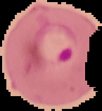

# Blood Cell Detection

This is a simple classification model using pytorch to detect malaria-infected blood cell

**created during an internship at nodeflux**

## How to run

Clone repository :

```bash
  git clone https://github.com/Deanazor/blood-cell.git
```

Go to repository folder :

```bash
  cd blood-cell
```

Build docker image :

```bash
  docker build -t deanazor/blood-cell .
```

## Or you can just simply pull the image
Pull docker image:

```bash
  docker pull deanazor/blood-cell
```

## Now, you can run the container
Run image :

```bash
  docker run --rm -p 8080:8080 deanazor/blood-cell
```

# Result

## Input :


## Output :
```python
{
    "filename": "2021-09-16_17:02:16-test_1.png",
    "result": [
        {
            "confidence": "0.9894008",
            "label": "uninfected"
        }
    ],
    "status": "OK"
}
```

## Input : 


## Output : 
```python
{
    "filename": "2021-09-16_17:02:44-test_2.png",
    "result": [
        {
            "confidence": "1.0",
            "label": "parasitised"
        }
    ],
    "status": "OK"
}
```

# Project Documentation
[Overleaf](https://www.overleaf.com/read/dtrjsvyxqmpw)

# Colab for training models

If you want to see (or even try to create your own model) try to see this colab and see if thing works out [Colab](https://colab.research.google.com/github/Deanazor/blood-cell/blob/master/model_training.ipynb)